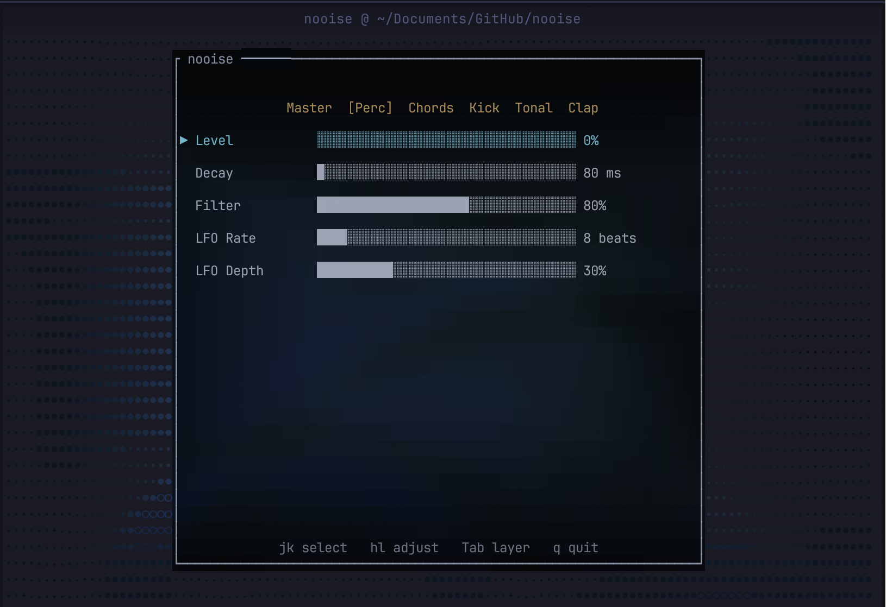

  

 

<table width="100%" cellspacing="0" cellpadding="0" border="0">

  <tr>
    <td width="90" valign="middle"></td>
    <td valign="middle" style="padding:0 12px">
      <strong><a href="https://github.com/ianjamesburke/PLEXI">Plexi</a></strong> 
      A multi-dimensional terminal multiplexer for the agentic era 
      
    </td>
    <td width="80" align="right" valign="middle"></td>
  </tr>

  <tr><td colspan="3" height="6"></td></tr>

  <tr>
    <td width="90" valign="middle"></td>
    <td valign="middle" style="padding:0 12px">
      <strong><a href="https://github.com/ianjamesburke/kill-tony-archive">Kill Tony Archive</a></strong> 
      Transcribes, analyzes, and ranks every 1-minute set from 500+ episodes 
      
      
    </td>
    <td width="80" align="right" valign="middle"><a href="https://killtonyarchive.com">Visit →</a></td>
  </tr>

  <tr><td colspan="3" height="6"></td></tr>

  <tr>
    <td width="90" valign="middle"></td>
    <td valign="middle" style="padding:0 12px">
      <strong><a href="https://github.com/ianjamesburke/nooise">nooise</a></strong> 
      Ambient music generator for the terminal — Rust synth engine with live controls 
      
    </td>
    <td width="80" align="right" valign="middle"></td>
  </tr>

  <tr><td colspan="3" height="6"></td></tr>

  <tr>
    <td width="90" valign="middle"></td>
    <td valign="middle" style="padding:0 12px">
      <strong><a href="https://github.com/ianjamesburke/fido">Fido</a></strong> 
      A TUI social app for nerds — real-time chat and community in your terminal 
      
    </td>
    <td width="80" align="right" valign="middle"><a href="https://fido-web-production.up.railway.app/">Visit →</a></td>
  </tr>

  <tr><td colspan="3" height="6"></td></tr>

  <tr>
    <td width="90" valign="middle"></td>
    <td valign="middle" style="padding:0 12px">
      <strong><a href="https://github.com/ianjamesburke/dad-circles-v1">Dad Circles</a></strong> 
      Location-first matching for local dads — privacy-first, no feeds, no likes 
      
      
    </td>
    <td width="80" align="right" valign="middle"><a href="https://dadcircles.com/">Visit →</a></td>
  </tr>

  <tr><td colspan="3" height="6"></td></tr>

  <tr>
    <td width="90" valign="middle"></td>
    <td valign="middle" style="padding:0 12px">
      <strong><a href="https://github.com/ianjamesburke/stint">Stint</a></strong> 
      Git-tracked sprint planning — tasks are markdown files, sprints are ordered lists, lives in <code>.stint/</code> 
      
    </td>
    <td width="80" align="right" valign="middle"></td>
  </tr>

  <tr><td colspan="3" height="6"></td></tr>

  <tr>
    <td width="90" valign="middle"></td>
    <td valign="middle" style="padding:0 12px">
      <strong><a href="https://github.com/ianjamesburke/entheocast">Entheocast</a></strong> 
      Psychedelic clinical trials and research aggregated weekly into a structured open dataset 
      
      
    </td>
    <td width="80" align="right" valign="middle"><a href="https://ianjamesburke.github.io/entheocast">Visit →</a></td>
  </tr>

  <tr><td colspan="3" height="6"></td></tr>

  <tr>
    <td width="90" valign="middle"></td>
    <td valign="middle" style="padding:0 12px">
      <strong><a href="https://github.com/ianjamesburke/moss">Moss</a></strong> 
      A tiny language that reads like English and compiles to Rust — learn it in a day 
      
    </td>
    <td width="80" align="right" valign="middle"></td>
  </tr>

</table>

 

  <a href="https://x.com/atfostermusic">𝕏 @atfostermusic</a>

