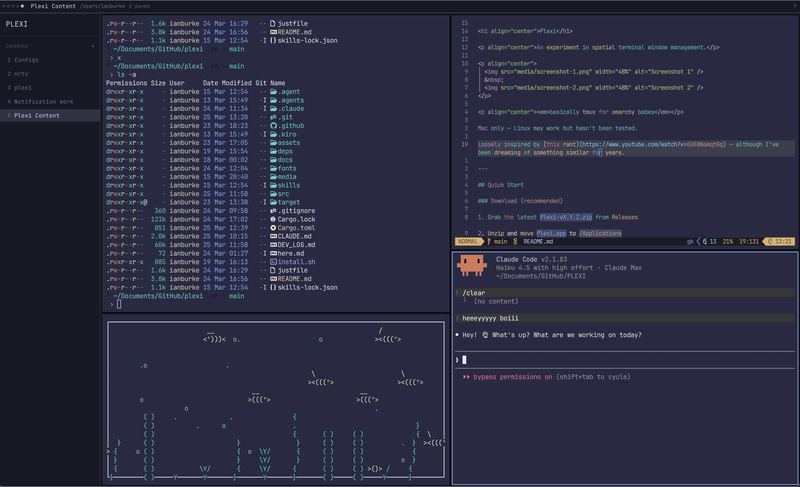
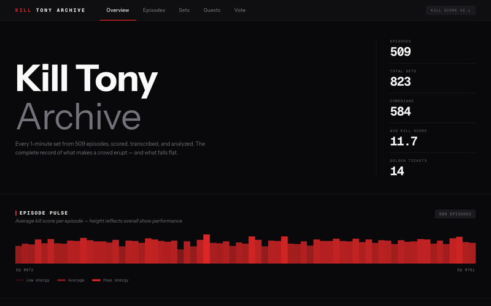
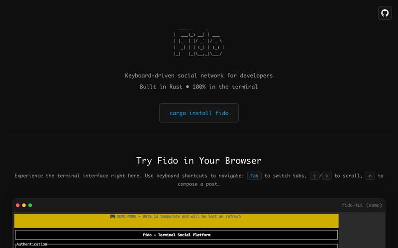
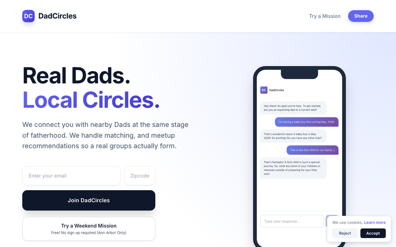

  

 

<table>
  <tr>
    <td valign="top" width="50%">
      
        
      <strong><a href="https://github.com/ianjamesburke/PLEXI">PLEXI</a></strong>
       
      A multi-dimensional terminal multiplexer for the agentic era
        
      
        
      <a href="https://github.com/ianjamesburke/PLEXI">GitHub →</a>
    </td>
    <td valign="top" width="50%">
      
        
      <strong><a href="https://killtonyarchive.com">kill-tony-archive</a></strong>
       
      Transcribes, analyzes, and ranks every 1-minute set from the Kill Tony podcast
        
      
      
        
      <a href="https://github.com/ianjamesburke/kill-tony-archive">GitHub →</a>
    </td>
  </tr>
  <tr>
    <td valign="top" width="50%">
      
        
      <strong><a href="https://fido-prod-ijb.web.app/">fido</a></strong>
       
      A TUI social app for nerds
        
      
        
      <a href="https://github.com/ianjamesburke/fido">GitHub →</a>
    </td>
    <td valign="top" width="50%">
      
        
      <strong><a href="https://dadcircles.com/">dad-circles</a></strong>
       
      Helping dads connect
        
      
      
        
      <a href="https://github.com/ianjamesburke/dad-circles-v1">GitHub →</a>
    </td>
  </tr>
</table>

  <a href="https://x.com/atfostermusic">𝕏 @atfostermusic</a>

